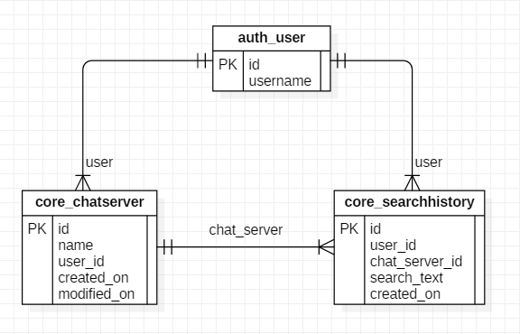
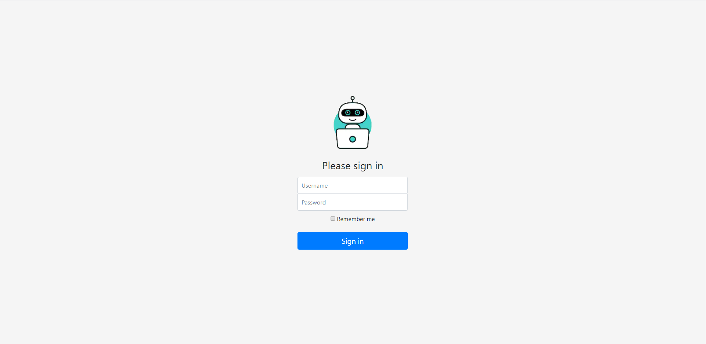
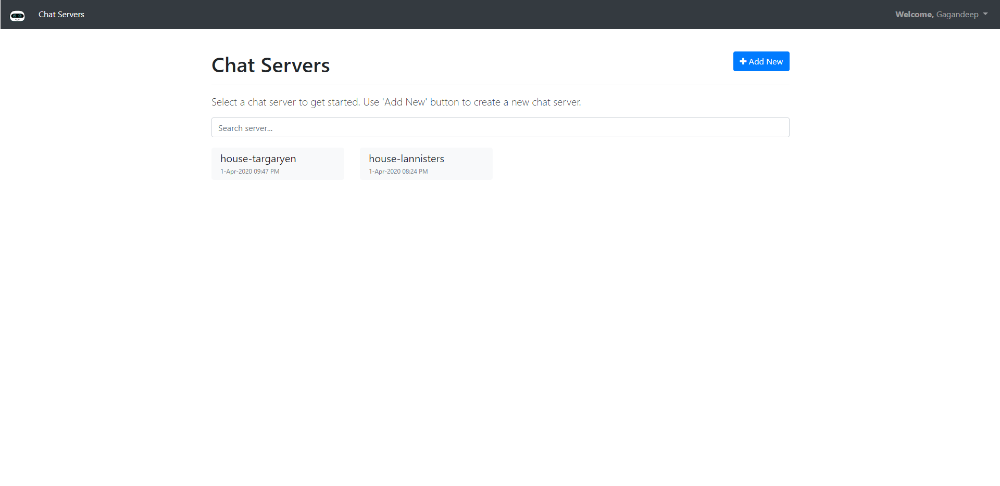
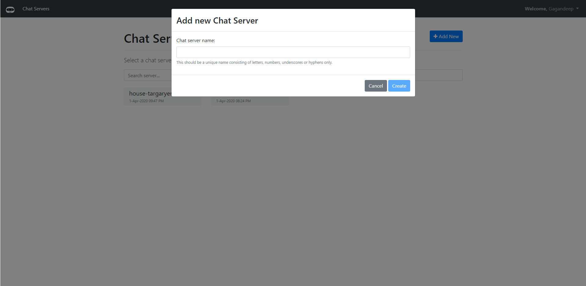
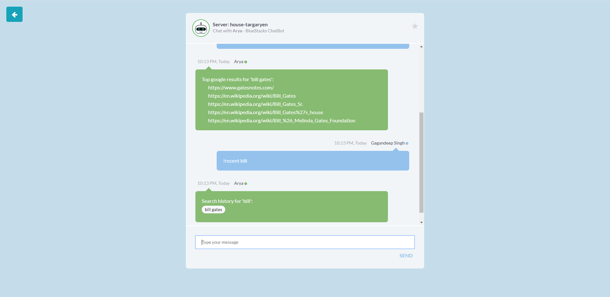
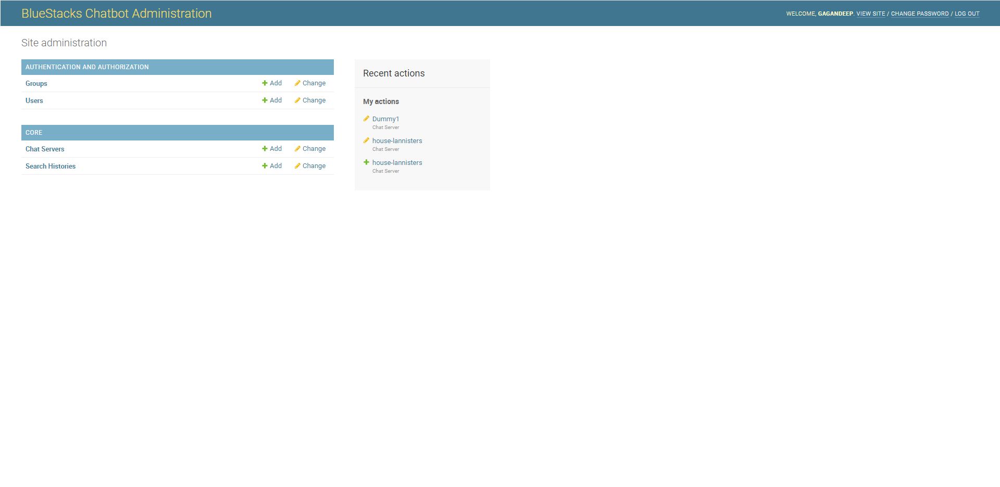

# ChatBot

Submission for BlueStacks [backend-developer-challenge](https://github.com/bluestacks/backend-developer-challenge).


## Technology Stack
- **Web Framework**: Python-Django
- **Backend**: PostgreSQL/SQLite
- **Frontend**: Bootstrap, AngularJs, JQuery


## Installation Instructions
- Create virtual environment
- Activate virtual environment
- Clone project
- Install project dependencies ([requirements.txt](requirements.txt))
    ```cmd
    pip install -r requirements.txt
    ```
- Edit database settings in `settings.py`
- Run database migrations:
    ```cmd
    python manage.py makemigrations
    python manage.py migrate
    ```
- Create superuser
    ```cmd
    python manage.py createsuperuser
    ```
- Run server:
    ```cmd
    python manage.py runserver
    ```
- Open any browser and go to:
    - Home page: [http://127.0.0.1:8000/](http://127.0.0.1:8000/)
    - Admin: [http://127.0.0.1:8000/admin/](http://127.0.0.1:8000/admin/)
    


## Database Design

- Model implementation: [core/models.py](core/models.py)
- ER Diagram:

    

## Chat Bot

- Bot implementation: [core/chatbot.py](core/chatbot.py)
- Message posting API: Method `post_message(request)` in [core/views.py](core/views.py)


## Screenshots

|    |   |
|---|---|
|    |   |
|   |   |
|   |   |


## Submitted By
- Gagandeep Singh
- Email: singh.gagan144@gmail.com
- Date: April, 2020


